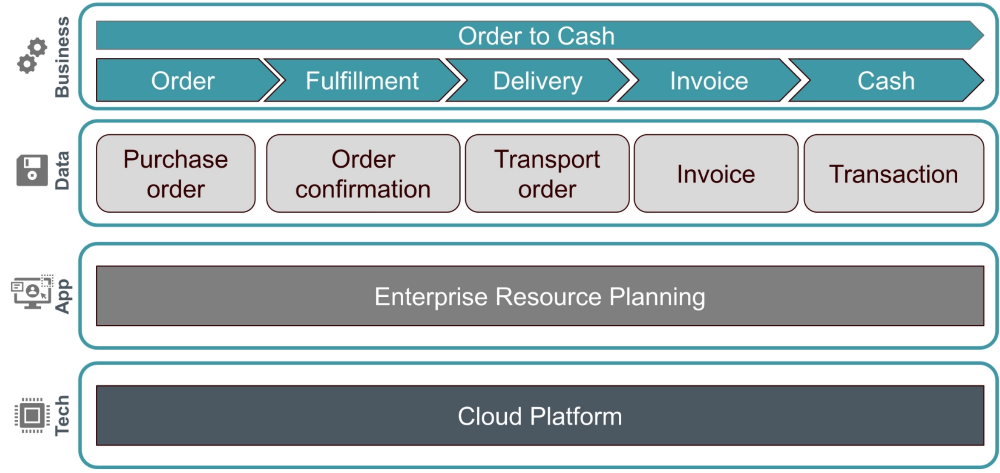

# Enterprise Architecture Foundation with TOGAF 10 Standard
* udemy.com/course/togaf-10-ea-foundation

# Introduction to Enterprise Architecture

## what is enterprise architecture
* entire enterprise or one or more specific areas of interest
* may comprimse multiple enterprises
* may include, partners, supplies, customers
* considered as a system
* may develop and maintain several independent enterprise architectures
* examples: corporation vs. d

## what is an architecture
* TOGAF uses ISO/IEEE 42010:2011
* the fundamental concepts or properties of a system in its environment embodied in its elements, releationships and in the priciples of its design & evoution (ISO)
* The structure of components, their interrelationships & the principles and guidelines governing their design & evolution over time. (TOGAF)

## what are the BDAT Architecture Domains and what do they describe
* Business architecture: defines the business strategy, governance, organization and key business processes.
  * describes:
    * Business capabilities
    * business processes
    * value stream
    * sinformation concepts
    * organization units
* Data architecture: describes the structure of an org's conceptual, logical & physical data assets, data management resources.
  * describes:
    * information objects
    * data objects
    * data management resources
* Application architecture: provides a blueprint for the individual applications to be deployed, their interactions and their relationships to the core business processes of the org.
  * describes:
    * applications
    * interfaces
    * application domains
    * application functions
    * application services
* Technology architecture: describes the digital architecture and the logical software and hardware infrastructure capabilities and standards that are required to support the deployment of busienss, data and application services
  * describes:
    * it infrastructure
    * middleware
    * network elements
    * technology platforms
    * cloud services
    * runtime environments

### you may create other architecture domains based on these architecture domains
* IT architecture: data + app + tech architectures
* digital architecture
* risk architecture
* security architecture

### how can you visualize an architecture
* based on artifacts
* 
* 

#### example: order to cash process for a business
* 

## architecture states
* an architecture is a snapshot in time.
  * architecture states are defined by: point in time, stakeholders, realization of value.
* early in timeline:
  * (IMPORTANT) Baseline architecture: current state acting as reference for all changes
    * "where we are today"
* middle of timeline:
  * resting architecture: state where the enterprise receives value if all change activity is suspended
  * transition architecture: fully functional future state that partially realizes target architecture with a specific time and target conformance. (use when incremental steps to target are needed)  You will have several.
* late in timeline:
  * candididate architecture: future state that stakeholders have not approved yet (unapproved target architectures).  You will have several.
  * (IMPORTANT) target architecture: defined future state of archtiecture that stakeholders have approved
    * "where we want to be"

## scoping architectures - EXAM
> [!NOTE]
> EXAM GOAL: briefly explain how to scope an architecture
* scope of the architectural activity is mostly limited by: people, finance, objectives, stakeholder concerns and the organization authority of the enterprise architecture team.
* four dimensions are used to define an architecture
* enterprise scope (breadth): what is the full extent of the enteprirse and what part of that extent will this architecting effort deal with?
  * involved components (can limit scope on these):
    * organizations
    * busienss unit
    * departments
    * processes
* level of detail (depth): to what level of detail should the architecting effort go?
  * how much architecture is "enough" (effort between architecture and system design & development)?
* architecture domains: which domains should be looked at?
  * involved components (can limit which domains you need to consider):
    * business
    * data
    * application
    * technology
* time period (planning horizon): what is the time period that needs to be articulated for the `Architecture Vision`?
  * does it make sense (practicality, resources) to be covered in a detailed `Architecture Description`.

## levels of the architectural landscape - EXAM
> [!NOTE]
> EXAM GOAL: list the three levels of the `Architecture Landscape`
* the purpose of the `Architectural Landscape` is to provide an organizing framework for change and operations describing and classifying the landscape.
* There are three `Architecture levels` within the `Architectural Landscape`

### (Enterprise) Strategic Architecture
* supports direction setting at an executive level. (this is long lived and covers all other architectures)

### Segment Architecture
* supports direction setting and the development of architecture roadmaps at a program or portfolio level. (there will be many, is made up of capabilities)

### capability architecture
* supports the development of effective architecture roadmaps realizing capability increments. (there will be many per segment architectures)

## architecture partitioning
> [!NOTE]
> EXAM GOAL: briefly explain how partitioning helps simplify the development of an Enterprise Architecture.
* a divided subset of an architecture facilitates its development & management
1. establish several archutecture partitions, providing defined boundaries, governance and ownership
2. apply partitioning to archtiecture until each architecture has one owning team
3. each team carrying out architecture activity within the enterprise owns one or more architecture partitions and will execute the ADM to define, govern and realize their architectures.
  * adopt a partitioning model that reflects the enterprise operating model 

### benefits of partitioning
* conflict management: org unit architectures conflict with one another
* re-use: effective archtiecture re-use requires modular architecture segments that can be taken and incorporated into broader architectures and solutions
* parallelization: partitions allow for specific groups of architects to own and develop specific elements of the architecture at the same time.
* manageable complexity & governance: partitioning divides and architecture into subsets to reduce complexity, ensure effective governance and simplify the development and management.

## architecture abstration levels
> [!NOTE]
> EXAM GOAL: briefly describe how `Architecture Abstration` can be used in enterprise architecture

* dividing a problem area into smaller problem areas makes the problem easier to model and to solve.
* the concept motivates the ask structure questions about an architecture
* note that abstraction levels cross Architecture Domains

### Why (contextual abstraction): why is the architecture needed?
* understand the environment of an enterprise operates and the context of architecture work.
* ex: what is the scope, motivation, drivers, goals, objectives

### what (conceptual abstraction): what functionality and other requirements need to be met by the architecture?
* understanding the problem
* requirements and service models
* what is necessary?
* may also be known as `service abstraction` or `behavior abstraction`
* ex: business service, application service, technology service

### How (logical abstraction): how do we structure the functionality?
* identify implementation-independent componentes to acheive the services of the conceptual abstraction
* ex: business, data, application and technology components

### with what (physical abstraction): with what assets shall we implement this structure?
* find alternatives for allocation and implementation of physical components to meet the logical components

### how are `Architecture Landscape` levels and `Architecture Abstraction` levels related
* each architecture landscape level can be described by architecture abstraction levels.
* Consider that you can describe a `Capability Architecture` by defining the `Architecture Abstraction` levels for that `Capability Architecture`.

## building blocks - EXAM
> [!NOTE] EXAM GOAL
> Explain what building blocks are and their use in the ADM

* Building Blocks ("bb"): the potentially re-usable component delivers architectures and solutions.
* is a package of cuntionality defined to meet the business needs across an organization (generally recognizable as "a thing" by domain experts).
* has normally a type that corresponds to the Enterprise Metamodel (ex: actor, business service, application, data entity)
* can be defined at various levels of detail, depending on the objectives of the Enterprise Architecture and the architecture development stage.
  * early in development: a building block might be simply a name or description
  * later: this may be updated with and described by multiple other sub-building blocks
* Can lead to improvements in legacy system integration, interoperability and flexibility in the creation of new systems and applications
  * An organization must decide what arragement of Building Blocks works best

### characteristics
* a good `building block` meets the following criteria:
  * considers implementation and usage and evolves to exploit technology and standards
  * is re-usable, replaceable and well specified
  * may be assembled from and a subassembly of other `building blocks`
  * may interoperate with other, interdependent `building blocks` based on a published and stable interface
  * should have defined boundaries and specs which are loosely couple to its implementation (ex: it's possible to realize a `building block` in several ways)
  * meets the business need
  * defined at various levels of detail

### types of building blocks
* `Architecture Building Blocks ("ABBs")`:
  * architectural components
  * describe the require capability
  * logical or supplied-independent
  * ex: "video conferencing services"
* `Solution Building Block ("SBBs")`:
  * solution components
  * realize the required capability
  * physical or implementation-specific
  * ex: "solutions (webex, zoom, teams), and network design, etc"

#### how these building block types relate
* ABBs shape the specification to establish SBBs.
* SBBs implement the capability described by ABBs.

## Introduction to The TOGAF standard
* TOGAF is a best practice framework for Enterprise Architecture.
* Enterprise Architecture Framework to develop any kind of architecture in any context.
* Developed through the collaborative efforts of the community.
* Can be applied for a range of use-cases (ex: agile enterprise, digital transformation)
* Describes a standard cycle of change, used to plan, develop, implement, govern, change and sustain an architecture.
* Describes the `Building Blocks` in an enterprise used to deliver busienss services & information systems.

### suitability and applicability
> [!NOTE] EXAM GOAL
> explain why the TOGAF standard is suitable for use as a framework for Enterprise Architecture

* TOGAF enables organizations to operate in an efficient & effective way using a proven and recognized set of best practices to address business and technology trend.
* enables the organization to build workable and economic solutions.
* adds value, standardizes and de-risks architecture development
* results in an Enterprise Architecture that is...
  * consistent
  * reflects the needs of stakeholders
  * employs best practice
  * considers current and future needs of the business

### tailoring and integration
* TOGAF may adopt elements from other frameworks
* allows the replacement or extension of its deliverables by a more specific set (defined by other frameworks).
* allows the integration of TOGAF methods to other standard frameworks or best practices (ex: ITIL, COBIT, PRINCE)
* should be tailored and integrated into the processes and organization structures
* may be used as a standalone framework

### structure of TOGAF standard
> [!NOTE] EXAM GOAL
> describe where guidance on how to apply the TOGAF Standard is provided

* TOGAF Standard documents are:
  * TOGAF Fundamental Content:
    * Introduction and core concepts: introduction to the standard and its core concepts.
    * Architecture Development Method: interative approach to developing and managing the lifecycle of Enterprise Architecture.
    * ADM Techniques: collection of techniques to apply the TOGAF approach and the Architecture Development Method (ADM).
    * Applying the ADM: guidelines for adapting the TOGAF ADM to address the specific type of architecture required.
    * Architecture content: typical Architecture deliverables and how to classify, storage, and re-use them.
    * Enterprise Archtiecture Capability and Governance: organizations, processes, roles and responsibilities to establish and operate Enterprise Architecture, and describes the governance framework.
  * TOGAF Series Guides:
    * Business Architecture
    * Information Architecture
    * Security Architecture
    * Enterprise Architecture/Agile Architecture
    * Enterprise Architecture/Digital Enterprise
    * Technology Architecture
    * MSA/SOA Architectures
    * Adapting the ADM
    * ...many more

### Breaking down documents that explain the ADM
> [!NOTE] EXAM GOAL
> briefly describe how the ADM and Supporting Guidelines and Techniques relate to each other

* individual guidelines & techniques are described separately so that they can be referenced from the relevant points in the ADM

* TOGAF Fundamental Content docs:
  * Architecture Development Method: interative approach to developing and managing the lifecycle of Enterprise Architecture.
  * ADM Techniques: collection of techniques to apply the TOGAF approach and the Architecture Development Method (ADM).
  * Applying the ADM: guidelines for adapting the TOGAF ADM to address the specific type of architecture required.
* TOGAF Series Guides: guidance on how to use and adapt the ADM for specific needs
* white papers & guides: classified and references in the TOGAF library

### what is the TOGAF library
> [!NOTE] EXAM GOAL
> describe where guidance on how to apply the TOGAF Standard is provided

* portfolio of additional gudiance material supports the practical application
* accompanies the TOGAF Standard
* offers guidance meterial to support the practical application of TOGAF
* contains guidelines, templates, patterns and reference material
* accelerates the cretion of new architectures for the enterprise
* maintained under the governance of The Open Group Architecture Forum

## enterprise architecture purpose
> [!NOTE] EXAM GOAL
> explain the purpose of Enterprise Architecture

* `Enterprise Architecture` is a framework for continuous change links strategic direction and business value.
* Manages compelxity and risks, supporting change
* optimizes processes into an integrated environment that is responsive to change and supportive of delivery of the business strategy and mission.
* provides enterprises a strategic context for the volution and reach of digital capability in response to the changing needs of the business environment
* achieves a balance between business transformation and operational efficiency
* allows business units to innovate to acheive business goals and competitive advantage
* enables an integrated strategy with synergies across the enterprise and beyond
* governs (directs and controls) the change activity to realize the expected value
* describes current and future state of an enterprise as well as the gap
  * defines scope of change and improvements
* documents processes around personal data that can be easily understood
* addresses the end state, performs prference trade-off and value realization for big and little questions

## enterprise architecture benefits
> [!NOTE] EXAM GOAL
> list the busienss benefits of having an Enterprise Architecture

* better return on existing investment & reduced risk for future investments
* more effective and efficient digital transformation and operations
* more effective strategic decision-making by c-level execs and business leaders
* more effective and efficient business operations
* faster, simpler, and cheaper procurement
* right balance across conflicting demands

> [!IMPORTANT] PAUSED Feb 21
> udemy.com/course/togaf-10-ea-foundation/learn/lecture/43351530#content